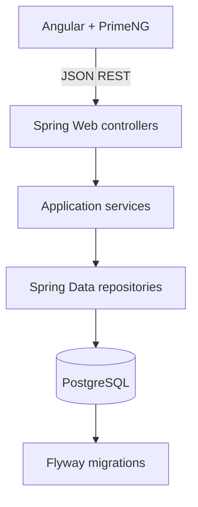

# Architecture

The repository is a modular monolith. It keeps the deployment and interview story small while separating employee, salary-history, department, dashboard, and cross-cutting concerns.

## Responsibilities and flow

- Angular route components own page state, form interaction, loading/empty/error presentation, and call `ApiService`.
- Controllers map HTTP requests to DTOs and delegate. They do not expose JPA entities.
- Services enforce duplicate checks, department lookup, compensation-history rules, status changes, pagination limits, and response mapping.
- Repositories own persistence, dynamic employee filtering, and dashboard aggregate projections.
- Flyway creates the relational schema. Hibernate validates it at startup.
- `GlobalExceptionHandler` converts validation, missing-resource, duplicate, bad-request, and unexpected failures into one safe error shape.

## Important decisions

Employee listing uses Spring Data `Page` and an allow-list of sortable fields. Dashboard totals are grouped by currency because no exchange-rate requirement exists; combining USD, GBP, INR, and other currencies would produce misleading numbers.

The `seed` Spring profile runs only when the employee table is empty. It uses a fixed random seed and batches 250 employees at a time. Authentication is intentionally not implemented because the assessment does not define identity or roles; deployment must add access control before real data is used.

## Failure handling and scale

Invalid input returns 400, missing employees 404, duplicate business values 409, and an unexpected server-side error 500 without stack traces. Database aggregates and indexed filters are sufficient for the requested 10,000 employees. A later iteration could add authentication, audit identity, rate limiting, background imports, caching, or read replicas without changing the core module boundaries.
